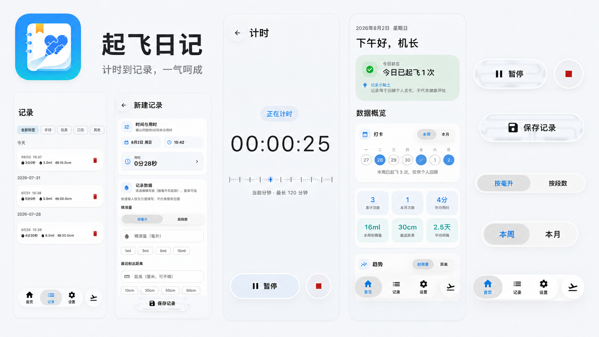

# 起飞日记（RiseDiary）

「起飞日记」是一款记录机长起飞的安卓APP，提供数据统计，应用采用 Jetpack Compose + Material 3 构建，以液态玻璃（Liquid Glass）作为核心视觉语言。

本项目受 [sky22333/luleme](https://github.com/sky22333/luleme) 的启发，由 Codex 协助编写。

> **隐私说明**：所有数据仅保存在设备本地，不会上传任何个人数据。应用唯一的外部访问是检查 GitHub 上的新版本（读取公开的版本信息），检查失败也不影响正常使用。

> **年龄提示**：**本应用建议 18 岁及以上人群使用。**

**⬇️ [下载最新版 APK](https://github.com/sky-shunfengjun/RiseDiary/releases/latest)　|　💬 [加入QQ群组](https://qm.qq.com/q/Z3XTPXXEEW)**

- 支持系统：Android 12（API 31）及以上；推荐 Android 13（API 33）及以上，Android 12/12L 会使用部分液态玻璃实体降级效果



*此图片由 AI 生成*

## 功能特性

### 液态玻璃 UI

基于 [Kyant0/AndroidLiquidGlass](https://github.com/Kyant0/AndroidLiquidGlass) 移植：

- 底栏、按钮、开关、滑杆、弹窗与分段控件均采用液态玻璃效果
- 保留原版的折射、高光、按压与拖动形变
- Android 12/12L 自动使用部分实体降级样式；Android 13 及以上启用完整 RuntimeShader 高光效果

### 首页看板

- 问候栏、今日状态卡片与记录小贴士
- 本周 7 天打卡 / 月历热力图切换
- 数据概览：累计次数、本月次数、平均用时、估算射精量、最远距离、平均间隔
- 射精量 / 射精距离趋势柱状图，长度追踪双线折线图（支持触摸标记与横向滚动）
- 首页卡片支持自定义排序与显隐

### 计时器

- 精密仪表式界面，`HH:MM:SS` 精确到秒
- 可快捷填充进表单

### 记录管理

- 表单字段：开始 / 结束时间、用时、射精量、距离、方式标签、备注
- 日期范围 + 方式标签筛选

### 应用锁

- PIN 码 + 系统指纹解锁
- 切换到后台自动锁定；可设置计时运行期间保持解锁

### 提醒

- 每日记录提醒
- 长时间未记录提醒
- 每月长度记录提醒

### 成就系统

- 21 个成就徽章（次数里程碑、连续记录、时长 / 距离 / 射精量、长度与特殊记录等）
- 解锁时弹出庆祝窗口，成就墙集中展示

### 数据管理

- ZIP 备份与恢复（记录、长度、标签、成就与设置）

### 其他

- 主题：跟随系统 / 浅色 / 深色
- 方式标签管理、首页卡片排序

## 技术栈


| 类别     | 技术                                                  |
| -------- | ----------------------------------------------------- |
| 语言     | Kotlin 2.2.21                                         |
| UI       | Jetpack Compose + Material 3（BOM 2025.10.01）        |
| 架构     | MVVM（ViewModel + Flow + Repository）                 |
| 依赖注入 | Hilt 2.57.2                                           |
| 数据库   | Room 2.8.4（含 KSP 编译）                             |
| 设置存储 | DataStore Preferences 1.1.7                           |
| 导航     | Navigation Compose 2.9.8                              |
| 后台任务 | WorkManager 2.10.1 + 前台服务                         |
| 生物识别 | AndroidX Biometric 1.1.0                              |
| 图表     | Vico 3.2.1                                            |
| 液态玻璃 | Kyant Backdrop 1.0.0 + Capsule 2.1.1                  |
| 序列化   | kotlinx.serialization JSON                            |
| 异步     | Kotlin Coroutines 1.8.1                               |
| 构建     | Gradle 8.13 / AGP 8.13.2、KSP                         |
| 支持版本 | 最低 Android 12（API 31），目标 Android 16（API 36） |

## 架构与构建

采用单向数据流：UI 事件 → ViewModel → Repository → Room / DataStore，界面由 Flow 驱动刷新。代码按 UI 层（Compose 页面与 ViewModel）、Repository、Room DAO / DataStore 分层。

构建方式：

1. 使用 Android Studio 打开项目根目录，等待 Gradle 同步完成后直接运行；
2. 或使用命令行（需要 JDK 17）：

```powershell
.\gradlew.bat assembleDebug
```

调试 APK 生成在 `app/build/outputs/apk/debug/`。

## 参与贡献

欢迎参与「起飞日记」的改进与完善！你可以：

- 通过 [Issues](https://github.com/sky-shunfengjun/RiseDiary/issues) 反馈 Bug、提出功能建议，或分享兼容性问题；
- 通过 [Pull Request](https://github.com/sky-shunfengjun/RiseDiary/pulls) 提交代码、文档、界面或测试改进；
- 加入 [QQ群组](https://qm.qq.com/q/Z3XTPXXEEW) 交流想法，欢迎任何形式的建议和贡献。

提交 Issue 或 Pull Request 时，尽量附上复现步骤、设备型号与 Android 版本，方便快速定位和处理。

## 未来方向

- 桌面小组件
- 更稳定的提醒调度
- 更完善的成就系统
- 完善可能不准确的表述

## 使用与致谢

- [sky22333/luleme](https://github.com/sky22333/luleme)（GPL-3.0）—— 产品灵感来源
- [Kyant0/AndroidLiquidGlass](https://github.com/Kyant0/AndroidLiquidGlass)（Apache-2.0）—— 液态玻璃组件（Backdrop、Capsule）的移植来源
- 本项目仓库：[sky-shunfengjun/RiseDiary](https://github.com/sky-shunfengjun/RiseDiary)

更完整的三方资源与依赖说明见 [THIRD-PARTY-NOTICES](THIRD-PARTY-NOTICES)。

## 许可证

本项目采用 [GPL-3.0](LICENSE) 协议发布
