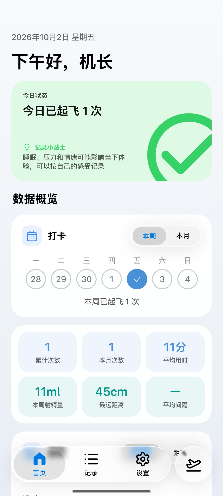
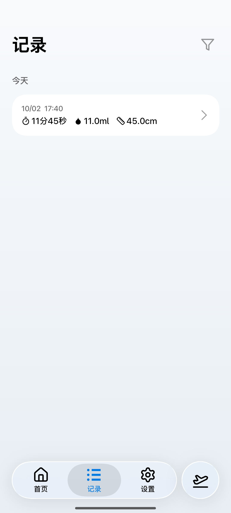
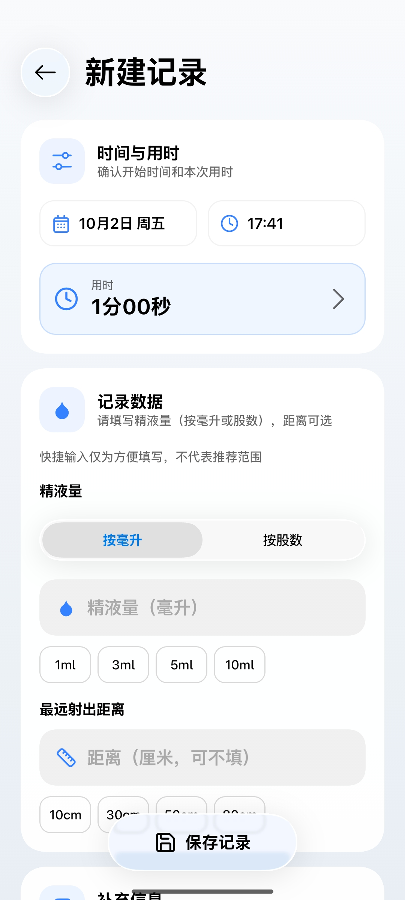
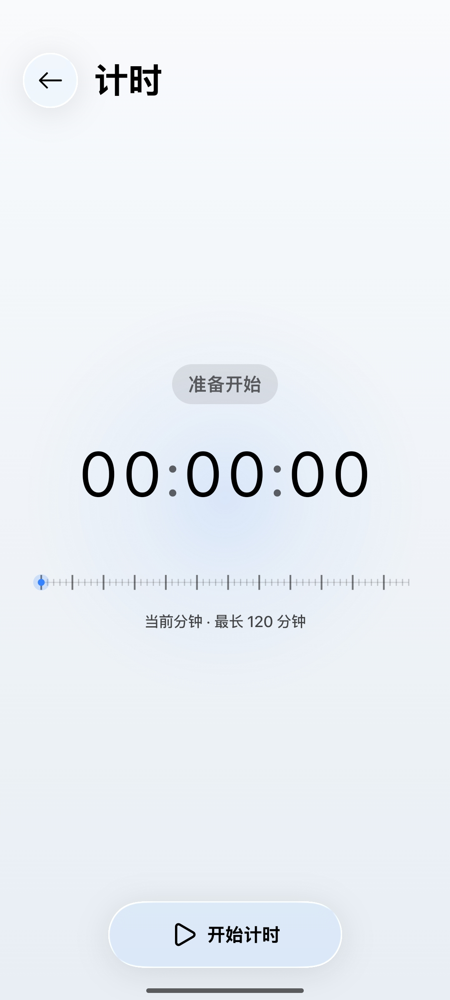
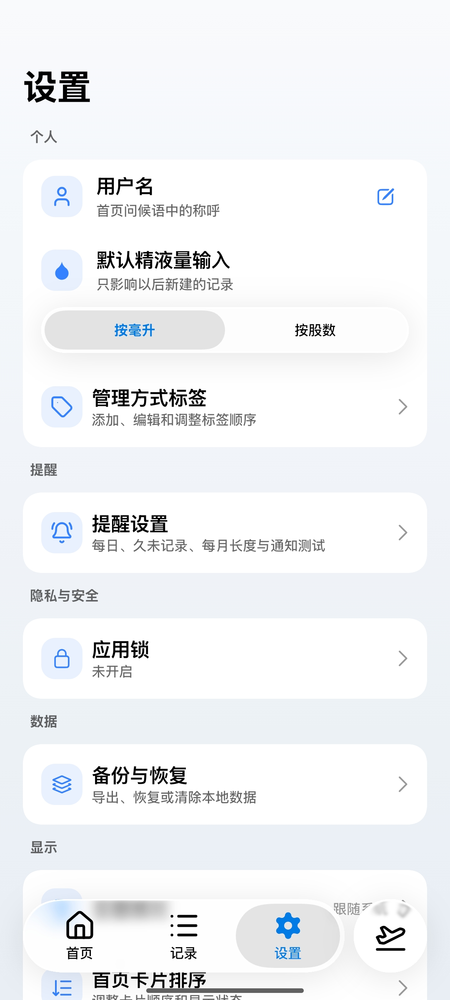
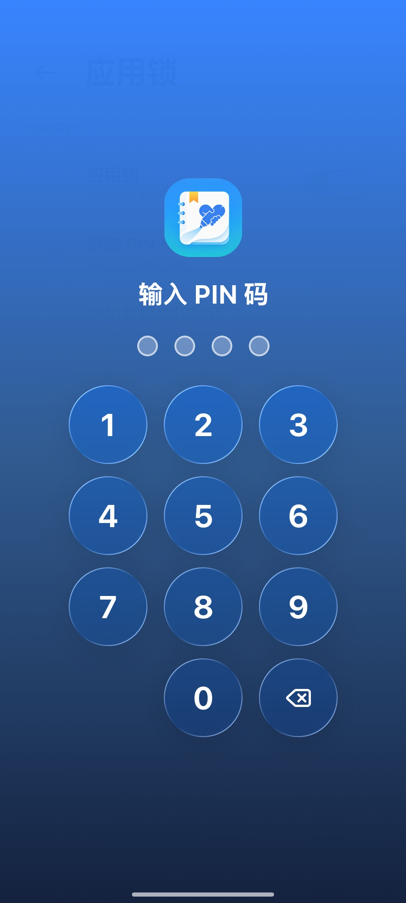

# 起飞日记（RiseDiary）

**下一次起飞，何必使用浏览器。**

「起飞日记」是一款面向成年用户的 Android 本地记录应用，提供起飞记录、计时、视频回看、长度追踪和数据统计。界面基于 Jetpack Compose 与 miuix，沿用 HyperOS 风格控件与液态玻璃效果。

本项目受 [sky22333/luleme](https://github.com/sky22333/luleme) 的启发，由 Codex 协助编写。

**⬇️ [下载最新版 APK](https://github.com/sky-shunfengjun/RiseDiary/releases/latest)　|　💬 [加入 QQ 群组](https://qm.qq.com/q/Z3XTPXXEEW)**

- 当前版本：**v2.0.0**
- 支持系统：**Android 12（API 31）及以上**；部分光效与玻璃效果在 Android 12/12L 使用兼容样式。
- 原生实时通知需要 **Android 16（API 36）及以上**及系统授权，实际展示方式由系统决定；其他支持版本可使用普通计时通知。

> **隐私说明**：无需注册账号，记录及个人设置保存在本机，不会自动上传到服务器。联网用于从 GitHub 检查版本和下载更新；选择 7ED 下载通道时，安装包下载会经过第三方加速服务。自动检查更新可在设置中关闭。
>
> **使用提示**：仅面向年满 18 周岁的用户。数量预测、统计与健康提示供个人参考，不构成医学诊断或治疗建议。应用锁不代表数据库或导出的 ZIP 备份已加密，请妥善保管备份文件。

## 应用截图

|    首页    |   记录页   | 新建记录页 |
| :--------: | :--------: | :--------: |
|  |  |  |
| **计时页** | **设置页** | **应用锁** |
|  |  |  |

## 功能特性

### 记录与数量

- 记录开始／结束时间、用时、射精量、距离、方式标签及备注，支持编辑、删除和撤销删除。
- 新建记录默认预测模式，滑块从 0 开始，选择大于 0 的数量后才能保存。
- 预测最大值默认 **8 毫升**，可在设置中调整为 **0.1–15 毫升**，步长为 **0.1 毫升**。
- 表单输入在临时后台或旋转时保留；明确放弃或进程结束后不恢复未保存表单。

### 普通计时与实时通知

- 仪表式计时界面，滚动数字精确到秒。
- 支持后台计时及运行／暂停中的计时恢复，结束后填入开始时间、结束时间与累计用时，表单中仍可修改。
- 可在设置中打开“实时通知”（Android16+）

### 视频播放与关联

- 从系统文件选择器选取本地视频，在 App 内播放，首次成功播放开始起飞计时。
- 单独暂停视频仍继续计时；暂停计时会暂停视频。暂停计时后点击视频播放可同时继续计时。
- 支持拖动进度、快进倒退、倍速、循环、按视频比例进入全屏，以及手动切换横竖屏。
- 全屏悬浮计时可拖动；收起时背景透明，展开后通过图标进行暂停、继续和结束操作。
- 计时结束后默认将视频关联到新记录，保存前可移除；记录详情可直接播放和全屏回看。
- “详情页视频默认隐藏”默认关闭。开启后用遮罩隐藏画面，保留文件名；手动显示后再播放，后台或锁屏返回时再次隐藏。
- 仅保存原视频的关联信息，不复制视频、不提供视频内容；文件删除、移动或权限失效后可重新关联，只修改当前记录。
- 切后台暂停播放；回到页面后等待手动播放。重新打开记录详情从头开始。

### 首页、统计与长度追踪

- 问候、今日状态和记录小贴士；本周打卡与月历热力图切换。
- 累计次数、本月次数、平均用时、本周射精量、最远距离与平均间隔等概览。
- 射精量／距离趋势图、长度追踪双线图，支持触摸查看数据与横向滚动。
- 首页卡片支持自定义排序与显隐；独立管理长度记录。

### 隐私、提醒与成就

- 应用锁支持 PIN 与系统生物识别；可设置后台锁定，以及计时期间保持解锁。
- 支持每日记录、长时间未记录与每月长度记录提醒。
- 21 个成就徽章，覆盖次数、连续记录、时长、距离、数量及长度等。

### 备份与恢复

- 导出 ZIP，包含起飞记录、长度记录、标签、成就及普通设置，**不包含视频文件**。
- 起飞与长度记录共用恢复模式，默认“合并记录”

### 界面与交互

- miuix（HyperOS 风格）控件与液态玻璃按钮、开关、滑块、分段控件和底栏。
- 支持跟随系统、浅色和深色主题，配合沉浸式系统栏、顶部渐进模糊与系统返回手势。
- 首次引导和更新介绍的光效与展开动画改编自 HyperCeiler，使用公开 Android API，并提供低版本回退。

## 技术栈

下列版本对应当前仓库配置。


| 类别     | 技术                                                 |
| -------- | ---------------------------------------------------- |
| 语言     | Kotlin 2.4.20                                        |
| UI       | Jetpack Compose（BOM 2026.09.00）+ miuix 0.9.4       |
| 液态玻璃 | Kyant Backdrop 2.0.1 + Capsule 2.1.1                 |
| 视频     | AndroidX Media3 1.11.1（ExoPlayer）                  |
| 架构     | MVVM（ViewModel + Flow + Repository）                |
| 依赖注入 | Hilt 2.60.1                                          |
| 数据库   | Room 2.8.4（数据库结构版本 8，保留历史迁移）         |
| 设置存储 | DataStore Preferences 1.1.7                          |
| 导航     | miuix-nav 0.9.4（NavDisplay）+ NavigationEvent 1.1.2 |
| 更新说明 | Multiplatform Markdown Renderer 0.35.0               |
| 后台任务 | WorkManager 2.10.1 + 计时前台服务                    |
| 生物识别 | AndroidX Biometric 1.1.0                             |
| 图表     | Vico 3.2.1 + Compose Canvas                          |
| 备份格式 | ZIP + JSON，分批与流式读写                           |
| 异步     | Kotlin Coroutines 1.8.1                              |
| 构建     | JDK 21 / Gradle 9.6.1 / AGP 9.1.0 / KSP 2.3.11       |
| SDK      | 最低 API 31，目标 API 36，编译 API 37                |

## 构建与验证

使用 Android Studio 打开项目根目录，安装对应 SDK，并确保 `JAVA_HOME` 指向 JDK 21。单元测试也使用 Java 21 工具链；若本机配置了 Java 安装路径，请检查其是否有效。

```powershell
# 调试版：com.risediary.app.dev
.\gradlew.bat :app:assembleDebug

# 单元测试、Lint、调试构建与设备测试编译
.\gradlew.bat :app:testDebugUnitTest :app:lintDebug :app:assembleDebug :app:assembleDebugAndroidTest

# 正式版：com.risediary.app，R8 混淆
.\gradlew.bat :app:lintRelease :app:assembleRelease
```

- 调试 APK：`app/build/outputs/apk/debug/`。
- 正式 APK：`app/build/outputs/apk/release/`；签名需自行提供根目录 `keystore.properties`，不要提交签名配置或密钥。
- 调试版与正式版包名不同，数据彼此独立；正式版本升级请使用相同包名与签名。
- 设备测试编译不等于已在手机上运行，光效、手势、视频性能与覆盖升级仍需实际设备验证。

## 参与贡献

欢迎通过 [Issues](https://github.com/sky-shunfengjun/RiseDiary/issues) 反馈问题，或通过 [Pull Request](https://github.com/sky-shunfengjun/RiseDiary/pulls) 提交改进。

反馈时请附上复现步骤、设备型号、Android／系统版本和 App 版本。日志、截图或备份可能包含个人内容，请自行决定提供哪些信息。

## 后续方向

- 桌面小组件与提醒体验完善。
- 小米手环 Pro 系列记录互联：目前仅预留记录身份和接口说明，尚未实现连接或同步。

## 开源致谢

本项目开发过程中，使用了以下项目的部分或全部内容，为项目功能实现与效率提升提供了重要支撑。在此特别向所有相关开源项目的维护者与贡献者致以诚挚的感谢，感谢社区开发者们的开源共享精神。

- [miuix](https://github.com/compose-miuix-ui/miuix)（Apache-2.0）
- [AndroidLiquidGlass / Backdrop](https://github.com/Kyant0/AndroidLiquidGlass)（Apache-2.0）
- [Capsule](https://github.com/Kyant0/Capsule)（Apache-2.0）
- [HyperCeiler](https://github.com/ReChronoRain/HyperCeiler)（AGPL-3.0-only）
- [KernelSU](https://github.com/tiann/KernelSU) 与 [KernelSU-Style-UI-Kit](https://github.com/chenaizhang/KernelSU-Style-UI-Kit)（引用部分为 GPL-3.0）
- [HyperIsland](https://github.com/1812z/HyperIsland)（MIT）
- [Lucide](https://github.com/lucide-icons/lucide)（ISC；相关 Feather 图标保留 MIT 声明）
- [AndroidX / Jetpack](https://developer.android.com/jetpack)、[Dagger / Hilt](https://dagger.dev/hilt/)、[Kotlin](https://github.com/JetBrains/kotlin)、[kotlinx.coroutines](https://github.com/Kotlin/kotlinx.coroutines)、[kotlinx.serialization](https://github.com/Kotlin/kotlinx.serialization)、[Vico](https://github.com/patrykandpatrick/vico) 与 [Multiplatform Markdown Renderer](https://github.com/mikepenz/multiplatform-markdown-renderer)
- [luleme](https://github.com/sky22333/luleme)（GPL-3.0，产品灵感来源，未复制代码）

完整来源、改编范围及许可见 [THIRD-PARTY-NOTICES](THIRD-PARTY-NOTICES) 和 [LICENSES](LICENSES)。

## 许可证

除另有声明的第三方代码外，本项目原创代码按 [GNU GPL v3（GPL-3.0-only）](LICENSE) 发布。

HyperCeiler 的改编代码保留 [AGPL-3.0-only](LICENSES/AGPL-3.0.txt)；其他第三方代码保留各自许可、版权与来源。
